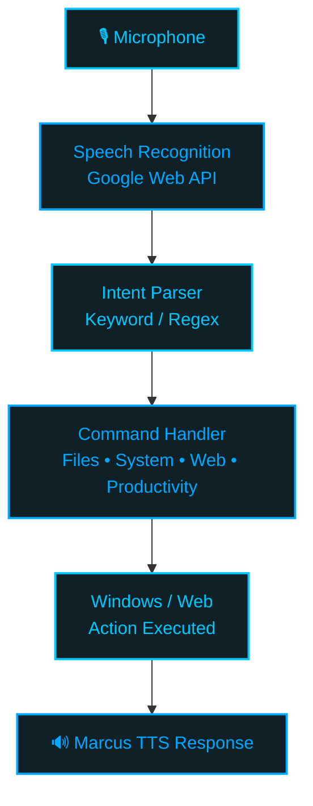

<div align="center">


<a href="https://github.com/MUdevelops/Marcus-PC-Assistant">
  
</a>

<br/>

<p>
  
  
  
  
</p>

<p>
  
  
  
  
</p>

<p>
  <a href="#-introduction"><b>Introduction</b></a> •
  <a href="#-features"><b>Features</b></a> •
  <a href="#-how-marcus-works"><b>Architecture</b></a> •
  <a href="#-screenshots"><b>Screenshots</b></a> •
  <a href="#-installation"><b>Installation</b></a> •
  <a href="#-commands"><b>Commands</b></a> •
  <a href="#-roadmap"><b>Roadmap</b></a>
</p>


</div>


## 🤖 Introduction

> **Marcus** is a Windows desktop voice assistant built around a simple idea:
> **your computer should understand what you say and help you get things done.**

Marcus listens for voice commands, interprets them with a keyword/regex intent parser, executes the requested Windows action, and responds through offline text-to-speech — wrapped in a futuristic **neon-blue / black** desktop interface.

The project combines a striking visual identity with practical PC automation — from opening applications and controlling volume to taking screenshots, searching the web, managing timers, and performing protected system actions.

<div align="center">

### ✨ Design Language

| Element | Marcus Style |
|:---|:---|
| 🎨 **Visual theme** | Deep black / navy + electric cyan-blue |
| 🧠 **Personality** | Futuristic, direct, helpful |
| ⚡ **Interaction** | Voice-first, with optional manual UI input |
| 🖥️ **Interface** | CustomTkinter desktop UI |
| 🔊 **Voice input** | Google Web Speech API |
| 🗣️ **Voice output** | `pyttsx3` + Windows SAPI5 |
| 🛡️ **Safety** | Confirmation before destructive actions |
| 📝 **Diagnostics** | Rotating command/outcome logs |

</div>


## 🚀 Features

<table>
<tr>
<td width="50%" valign="top">

### 🎙️ Voice Control
- Wake word support: **"Hey Marcus"**
- Speech-to-text via Google Web Speech API
- Offline text-to-speech via `pyttsx3`
- Direct command recognition (wake word optional)

### 🖥️ Windows Control
- Open apps, files, and folders
- Close / minimize / maximize / restore windows
- Switch between applications
- Volume control, mute / unmute
- Display brightness control
- Screenshots & webcam toggle
- Lock screen
- Sleep / restart / shutdown *(with confirmation)*
- Battery, Wi-Fi & disk space checks

</td>
<td width="50%" valign="top">

### 🌐 Web & Media
- Open websites
- Google search
- YouTube search

### ⏱️ Productivity
- Current date & time
- Named & unnamed timers
- Cancel / list active timers

### 🎨 Futuristic UI
- Responsive splash screen
- Neon-blue visual system
- Animated listening indicator
- Chat / transcript component
- Home • Apps • Tools • Settings navigation

### 🛡️ Safety First
Destructive actions — **close, sleep, restart, shutdown** — always require confirmation before executing.

</td>
</tr>
</table>


## 🧩 How Marcus Works

<div align="center">



</div>


## 🛠️ Technology Stack

<div align="center">

<p>
  
  
  
  
  
  
  
  
  
  
  
</p>

</div>

| Layer | Technology |
|:---|:---|
| Language | **Python 3.11.9** |
| Speech Recognition | `SpeechRecognition` |
| Microphone | `PyAudio` |
| Text-to-Speech | `pyttsx3` |
| Desktop UI | `CustomTkinter` |
| Image Processing | `Pillow` |
| Windows Audio | `pycaw` / `comtypes` |
| Brightness | `screen-brightness-control` |
| System Information | `psutil` |
| Automation | `pyautogui` |
| Windows Integration | `pywin32` |
| Configuration | `python-dotenv` |

All dependencies are pinned in [`requirements.txt`](requirements.txt).


## 📸 Screenshots

<div align="center">

<table>
<tr>
<td align="center" width="50%">
<b>🌌 Main Interface</b><br/><br/>

<br/><sub>Marcus's primary desktop interface — the central command environment.</sub>
</td>
<td align="center" width="50%">
<b>🗣️ Manual Command</b><br/><br/>

<br/><sub>Manual command input when voice interaction isn't convenient.</sub>
</td>
</tr>
<tr>
<td align="center" width="50%">
<b>🎙️ Ready to Assist</b><br/><br/>

<br/><sub>Visual state showing Marcus is ready for your next command.</sub>
</td>
<td align="center" width="50%">
<b>⚙️ Settings</b><br/><br/>

<br/><sub>Configure Marcus from the dedicated settings interface.</sub>
</td>
</tr>
<tr>
<td align="center" width="50%">
<b>🧰 Tools</b><br/><br/>

<br/><sub>Tools and utility controls available from the Marcus interface.</sub>
</td>
<td align="center" width="50%">
<b>🚀 Splash Screen</b><br/><br/>

<br/><sub>A responsive futuristic splash experience on launch.</sub>
</td>
</tr>
</table>

<b>🧠 Marcus Info</b><br/><br/>

<br/><sub>The Marcus visual identity and introduction artwork that inspired this README's presentation.</sub>

</div>


## 💬 Commands

<details open>
<summary><b>📁 Files & Applications</b></summary>

```text
Hey Marcus, open chrome
open notepad
open downloads
close notepad
close the active window
minimize
maximize
restore the window
switch to chrome
```
</details>

<details>
<summary><b>🖥️ System</b></summary>

```text
brightness up
brightness down
set brightness to 70

volume up
volume down
mute
unmute
set volume to 40

take a screenshot
open the camera
close the camera
lock the screen

go to sleep
shut down
restart

what's my battery
check wifi
disk space
```
</details>

<details>
<summary><b>🌐 Web</b></summary>

```text
go to github.com
open the website reddit
search google for python tutorials
search youtube for lofi beats
```
</details>

<details>
<summary><b>⏱️ Productivity</b></summary>

```text
what time is it

set a timer for 10 minutes
set a timer for 5 minutes for pasta

cancel the pasta timer
list timers
```
</details>


## 📦 Installation

<table>
<tr><td>

**1. Clone the repository**
```bash
git clone https://github.com/MUdevelops/Marcus-PC-Assistant.git
cd Marcus-PC-Assistant
```

**2. Create a virtual environment**
```bash
python -m venv venv
venv\Scripts\activate
```

**3. Install PyAudio**

On Windows, PyAudio may fail to build from source — install it through `pipwin` first:
```bash
pip install pipwin
pipwin install pyaudio
```

**4. Install the remaining dependencies**
```bash
pip install -r requirements.txt
```

**5. Launch Marcus**
```bash
python main.py
```

**Optional modes**
```bash
python main.py --ui
python main.py --console
```

</td></tr>
</table>

### ⚙️ Configuration

Wake-word-only operation can be enabled in `config.py`:

```python
REQUIRE_WAKE_WORD = True
```

When enabled, Marcus requires **"Hey Marcus"** before processing a command.


## 🧱 Project Architecture

```text
Marcus-PC-Assistant/
│
├── commands/
│   ├── files_apps.py
│   ├── system.py
│   ├── media_web.py
│   └── productivity.py
│
├── ui/
│   ├── app.py
│   ├── theme.py
│   ├── assets/
│   └── components/
│       ├── sidebar.py
│       ├── chat_bubble.py
│       └── mic_button.py
│
├── utils/
│   ├── confirmation.py
│   └── window_utils.py
│
├── logs/
│   └── marcus.log
│
├── main.py
├── config.py
├── listener.py
├── speaker.py
├── intent_parser.py
├── logger_setup.py
├── requirements.txt
└── README.md
```


## 🔧 Extending Marcus

| Task | Where |
|:---|:---|
| Add a known application | `commands/files_apps.py` → `KNOWN_APPS` |
| Add a file/folder shortcut | `commands/files_apps.py` → `KNOWN_PATHS` |
| Add a new voice phrase | `intent_parser.py` — add a new regex pattern + handler |
| Add new UI sections | `ui/app.py` → `_on_nav_select()` connects new **Apps / Tools / Settings** views |

> ⚠️ Patterns in `intent_parser.py` are checked **top-to-bottom**, and the first match wins — so more specific patterns should be listed before general ones.


## 🧪 Testing Individual Components

```bash
python speaker.py
python listener.py
python ui/app.py
python main.py
```

These commands give focused ways to test the TTS engine, listener, UI, and complete application independently.


## 📝 Logging & Troubleshooting

Marcus records recognized commands and their outcomes in `logs/marcus.log`. If a command doesn't behave as expected, check the log first.

**Windows notes**
- Most standard actions do not require administrator rights.
- Some interactions with elevated applications may require elevated privileges.
- Brightness support depends on the display exposing WMI or DDC/CI controls.
- External monitors may not support brightness adjustment.
- Windows Core Audio functions use COM through `pycaw`.


## 🛡️ Responsible Automation

Marcus is designed to make everyday PC interaction faster **without removing user control**.

Destructive operations use confirmation handling, and closing an application sends a normal Windows close request rather than forcibly killing the process — so applications can still display their own **"Save changes?"** dialogs.


## 🗺️ Roadmap

- [ ] More natural-language intent understanding
- [ ] More customizable commands
- [ ] Expanded Apps / Tools / Settings panels
- [ ] More visual assistant states
- [ ] Custom wake-word engine
- [ ] Offline speech recognition option
- [ ] Plugin-style command modules
- [ ] User-configurable themes
- [ ] More productivity integrations


## 🤝 Contributing

Contributions are welcome! Feel free to open an issue or submit a pull request.

1. Fork the repository
2. Create your feature branch (`git checkout -b feature/amazing-feature`)
3. Commit your changes (`git commit -m 'Add amazing feature'`)
4. Push to the branch (`git push origin feature/amazing-feature`)
5. Open a Pull Request


## 📄 License

This project is licensed under the **MIT License** — see [`LICENSE`](LICENSE) for details.

<div align="center">


**Your digital partner. Always on your side.**

<a href="https://github.com/MUdevelops/Marcus-PC-Assistant">
  
</a>

**If Marcus helps you, consider giving the repository a ⭐**

</div>
