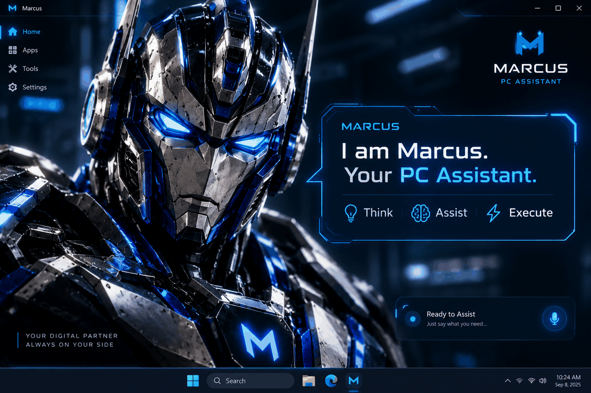
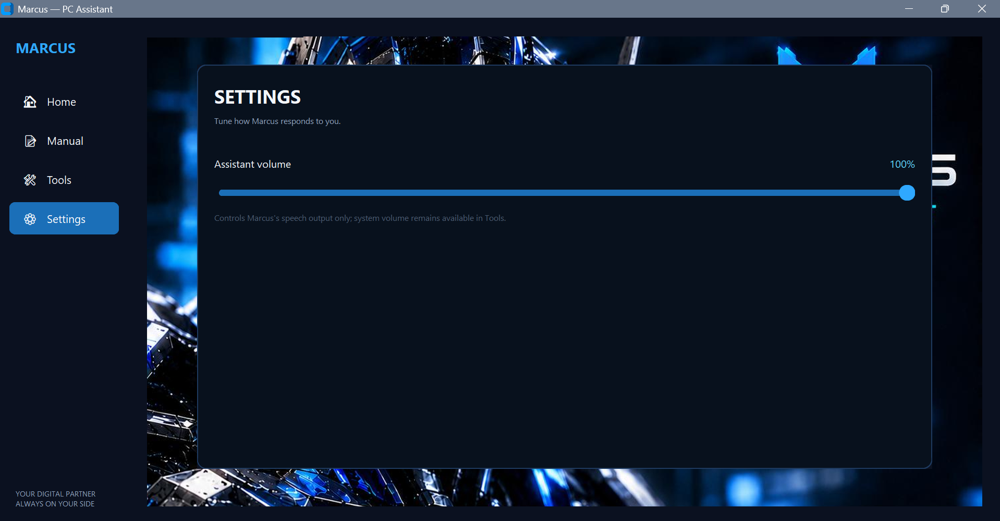
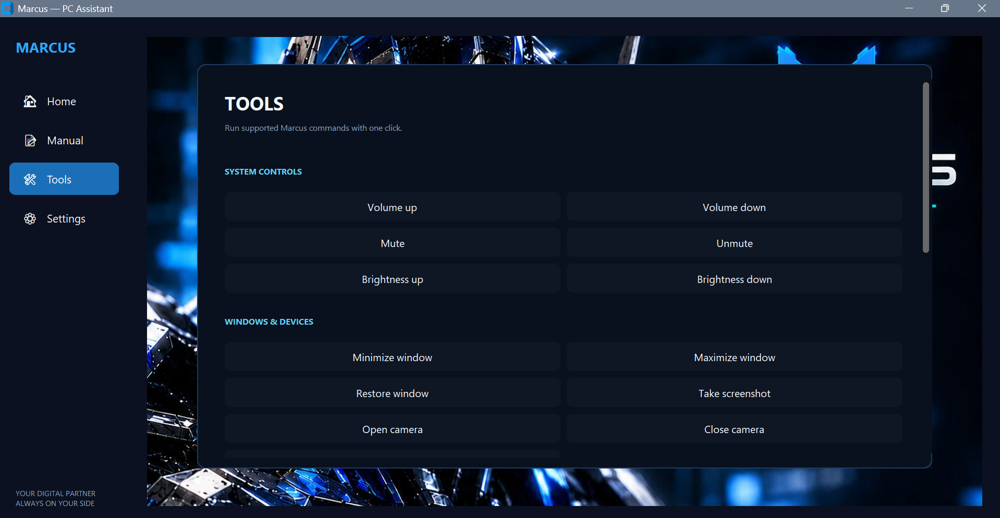

<div align="center">

# ⚡ MARCUS — PC ASSISTANT

### **Think • Assist • Execute**

A futuristic **Jarvis-style Windows voice assistant** built in Python, designed to control your PC through natural voice commands while providing a polished neon-blue desktop interface.

<p>
  
  
  
  
</p>

<p>
  <a href="#-introduction">Introduction</a> •
  <a href="#-features">Features</a> •
  <a href="#-screenshots">Screenshots</a> •
  <a href="#-installation">Installation</a> •
  <a href="#-commands">Commands</a> •
  <a href="#-architecture">Architecture</a>
</p>



</div>

---

## 🤖 Introduction

<div align="center">


</div>

> **Marcus** is a Windows desktop voice assistant built around a simple idea:
> **your computer should understand what you say and help you get things done.**

Marcus listens for voice commands, interprets them with a keyword/regex intent parser, executes the requested Windows action, and responds through offline text-to-speech.

The project combines a **futuristic blue/black visual identity** with practical PC automation — from opening applications and controlling volume to taking screenshots, searching the web, managing timers, and performing protected system actions.

### ✨ Design Language

| Element | Marcus Style |
|---|---|
| 🎨 Visual theme | Deep black / navy + electric cyan-blue |
| 🧠 Personality | Futuristic, direct, helpful |
| ⚡ Interaction | Voice-first with optional manual UI interaction |
| 🖥️ Interface | CustomTkinter desktop UI |
| 🔊 Voice input | Google Web Speech API |
| 🗣️ Voice output | `pyttsx3` + Windows SAPI5 |
| 🛡️ Safety | Confirmation before destructive actions |
| 📝 Diagnostics | Rotating command/outcome logs |

---

## 🚀 Features

### 🎙️ Voice Control
- Wake word support: **“Hey Marcus”**
- Speech-to-text through Google Web Speech API
- Offline text-to-speech through `pyttsx3`
- Direct command recognition without requiring the wake word when configured

### 🖥️ Windows Control
- Open applications, files and folders
- Close, minimize, maximize and restore windows
- Switch between applications
- Control system volume
- Mute / unmute
- Adjust display brightness
- Take screenshots
- Open / close webcam
- Lock the screen
- Sleep, restart and shutdown with confirmation
- Check battery, Wi-Fi and disk space

### 🌐 Web & Media
- Open websites
- Google searches
- YouTube searches

### ⏱️ Productivity
- Current date/time
- Timers
- Named timers
- Cancel timers
- List active timers

### 🎨 Futuristic UI
- Responsive splash screen
- Neon-blue visual system
- Main menu artwork
- Sidebar navigation
- Animated microphone/listening indicator
- Chat/transcript component
- Home / Apps / Tools / Settings navigation structure

### 🛡️ Safety First
Marcus does not blindly execute destructive operations. Actions such as **close, sleep, restart and shutdown** use confirmation handling before execution.

---

## 🧩 How Marcus Works

```text
┌──────────────────┐
│   🎙️ Microphone  │
└────────┬─────────┘
         │
         ▼
┌──────────────────┐
│ Speech Recognition│
│  Google Web API   │
└────────┬─────────┘
         │
         ▼
┌──────────────────┐
│  Intent Parser    │
│ Keyword / Regex   │
└────────┬─────────┘
         │
         ▼
┌──────────────────┐
│ Command Handler   │
│ Files / System /  │
│ Web / Productivity│
└────────┬─────────┘
         │
         ▼
┌──────────────────┐
│ Windows / Web     │
│ Action Executed   │
└────────┬─────────┘
         │
         ▼
┌──────────────────┐
│   🔊 Marcus TTS   │
│    Response       │
└──────────────────┘
```

---

## 🛠️ Technology Stack

| Layer | Technology |
|---|---|
| Language | **Python 3.11.9** |
| Speech Recognition | `SpeechRecognition` |
| Microphone | `PyAudio` |
| Text-to-Speech | `pyttsx3` |
| Desktop UI | `CustomTkinter` |
| Image Processing | `Pillow` |
| Windows Audio | `pycaw` / `comtypes` |
| Brightness | `screen-brightness-control` |
| System Information | `psutil` |
| Automation | `pyautogui` |
| Windows Integration | `pywin32` |
| Configuration | `python-dotenv` |

The repository pins these dependencies in `requirements.txt`.

---

## 📸 Screenshots

### 🌌 Main Interface

<div align="center">

</div>

Marcus's primary desktop interface — the central command environment.

---

### 🗣️ Manual Command

<div align="center">

</div>

Use the interface for manual command input when voice interaction isn't convenient.

---

### 🎙️ Ready to Assist

<div align="center">

</div>

A visual state showing that Marcus is ready to receive your next command.

---

### ⚙️ Settings

<div align="center">

</div>

Configure Marcus from the dedicated settings interface.

---

### 🧰 Tools

<div align="center">

</div>

Tools and utility controls available from the Marcus interface.

---

### 🚀 Splash Screen

<div align="center">

</div>

The application launches with a responsive futuristic splash experience.

---

### 🧠 Marcus Info

<div align="center">

</div>

The Marcus visual identity and introduction artwork that inspired this README's presentation.

---

## 💬 Commands

### 📁 Files & Applications

```text
Hey Marcus, open chrome
open notepad
open downloads
close notepad
close the active window
minimize
maximize
restore the window
switch to chrome
```

### 🖥️ System

```text
brightness up
brightness down
set brightness to 70

volume up
volume down
mute
unmute
set volume to 40

take a screenshot
open the camera
close the camera
lock the screen

go to sleep
shut down
restart

what's my battery
check wifi
disk space
```

### 🌐 Web

```text
go to github.com
open the website reddit
search google for python tutorials
search youtube for lofi beats
```

### ⏱️ Productivity

```text
what time is it

set a timer for 10 minutes
set a timer for 5 minutes for pasta

cancel the pasta timer
list timers
```

---

## 📦 Installation

### 1. Clone the repository

```bash
git clone https://github.com/MUdevelops/Marcus-PC-Assistant.git
cd Marcus-PC-Assistant
```

### 2. Create a virtual environment

```bash
python -m venv venv
venv\Scripts\activate
```

### 3. Install PyAudio

On Windows, PyAudio may fail to build from source. The repository recommends installing it through `pipwin` first:

```bash
pip install pipwin
pipwin install pyaudio
```

### 4. Install the remaining dependencies

```bash
pip install -r requirements.txt
```

### 5. Launch Marcus

```bash
python main.py
```

### Optional modes

```bash
python main.py --ui
python main.py --console
```

---

## ⚙️ Configuration

Wake-word-only operation can be enabled in:

```text
config.py
```

Set:

```python
REQUIRE_WAKE_WORD = True
```

When enabled, Marcus requires **“Hey Marcus”** before processing a command.

---

## 🧱 Project Architecture

```text
Marcus-PC-Assistant/
│
├── commands/
│   ├── files_apps.py
│   ├── system.py
│   ├── media_web.py
│   └── productivity.py
│
├── ui/
│   ├── app.py
│   ├── theme.py
│   ├── assets/
│   └── components/
│       ├── sidebar.py
│       ├── chat_bubble.py
│       └── mic_button.py
│
├── utils/
│   ├── confirmation.py
│   └── window_utils.py
│
├── logs/
│   └── marcus.log
│
├── main.py
├── config.py
├── listener.py
├── speaker.py
├── intent_parser.py
├── logger_setup.py
├── requirements.txt
└── README.md
```

---

## 🔧 Extending Marcus

### Add a known application

Update:

```text
commands/files_apps.py
```

and add the application to:

```python
KNOWN_APPS
```

### Add a file/folder shortcut

Add the path to:

```python
KNOWN_PATHS
```

### Add a new voice phrase

Extend:

```text
intent_parser.py
```

by adding a new regex pattern and handler.

> Patterns are checked **top-to-bottom** and the first matching pattern wins, so more specific patterns should come before general patterns.

### Add new UI sections

The main navigation hook is located in:

```text
ui/app.py
```

The `_on_nav_select()` method is the primary place to connect new **Apps / Tools / Settings** views.

---

## 🧪 Testing Individual Components

```bash
python speaker.py
python listener.py
python ui/app.py
python main.py
```

These provide focused ways to test the TTS engine, listener, UI and complete application.

---

## 📝 Logging & Troubleshooting

Marcus records recognized commands and their outcomes in:

```text
logs/marcus.log
```

If a command does not behave as expected, check the log first.

### Windows notes

- Most standard actions do not require administrator rights.
- Some interactions with elevated applications may require elevated privileges.
- Brightness support depends on the display exposing WMI or DDC/CI controls.
- External monitors may not support brightness adjustment.
- Windows Core Audio functions use COM through `pycaw`.

---

## 🛡️ Responsible Automation

Marcus is designed to make everyday PC interaction faster without removing user control.

Destructive operations use confirmation handling, and closing an application sends a normal Windows close request rather than forcibly killing the process. Applications can therefore still display their own **“Save changes?”** dialogs.

---

## 🗺️ Roadmap

Potential future improvements:

- [ ] More natural-language intent understanding
- [ ] More customizable commands
- [ ] Expanded Apps / Tools / Settings panels
- [ ] More visual assistant states
- [ ] Custom wake-word engine
- [ ] Offline speech recognition option
- [ ] Plugin-style command modules
- [ ] User-configurable themes
- [ ] More productivity integrations

---

## 🌐 Repository

<div align="center">

**Explore Marcus on GitHub**

<a href="https://github.com/MUdevelops/Marcus-PC-Assistant">
  
</a>

<br><br>

**Your digital partner. Always on your side.**

### ⚡ Think → Assist → Execute

</div>

---

## 📄 License

This project is licensed under the **MIT License**.

See [`LICENSE`](LICENSE) for details.

---

<div align="center">

### 🤖 MARCUS

**PC ASSISTANT**

*Built for Windows • Powered by Python • Designed for the future*

<br>

**If Marcus helps you, consider giving the repository a ⭐**

<br><br>


</div>
